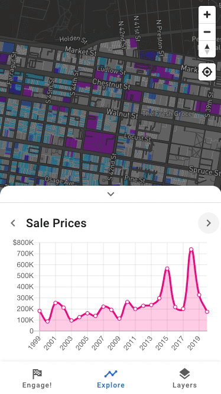

# LetsPlan.org

A tool for neighbors to learn from about their RCO with open data and engage in community planning.

## Documentation

See this repository's GitHub Pages website for documentation automatically build from the `docs/` directory: <https://urbanspatial.github.io/LetsPlanOrg>

## Technology components

- Laravel backend
- Vue frontend
- Mapbox GL vector map
- Kubernetes deployment via Helm
- GitHub Actions build automation

## Screenshots

### Sale price indicator

### Other indicators

